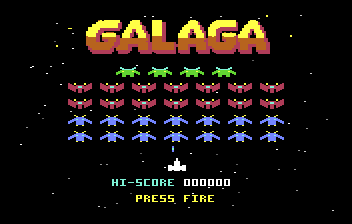

# 64galaga

A Galaga clone for the Commodore 64, written in 6502 assembly ([ACME](https://sourceforge.net/projects/acme-crossass/)).



**[▶ Play in the browser](https://vc64web.github.io/#openROMS=true#https://raw.githubusercontent.com/Shadester/galagas/7f91b7ccb7e6460f097d556d593cd9f35d49f0e0/c64/docs/galaga.prg)** (runs in the [vc64web](https://vc64web.github.io) emulator; set up a joystick or keyset in its settings, see Controls below. The hi-score is not saved there.)

## Features

- 32-alien formation in 5 rows: 4 bosses, 14 butterflies, 14 bees, with wing-flap animation. (The arcade has 40 aliens in rows of 10. The VIC-II cannot show 10 sprites in a row.)
- **Fly-in:** at the start of each stage the aliens swoop in along the arcade's flight paths in five groups of up to eight and settle into the formation (the arcade has 40 aliens: the 8 that have no place in our 7 columns do not fly in)
- **Arcade rules:** the dive scheduler, the escorts, the bombs, the tractor beam, the death and the respawn follow the arcade Galaga (see [`../ARCADE.md`](../ARCADE.md)). `../psp/game.c` built with `-DRULES_ARCADE32` has the same rules in C. `../tools/compare_6502.py c64` runs both games and compares them tick by tick
- Dives: three timers send a boss, a butterfly or a bee out of the formation. The stage and the number of aliens left set the timers and the number of divers. A diver steers towards you and drops aimed bombs (four at most on the screen)
- **Tractor beam capture:** every second boss sortie tries to capture your ship. The beam grows row by row, holds for about one second and shrinks again. Shoot that boss while it dives to free the ship and fly a **dual fighter** with double firepower. Shoot it while it is still in formation and the captive is lost
- Bosses take two hits
- Arcade scoring: 50/100 (bee), 80/160 (butterfly), 150/400 (boss, formation/diving), 1,000 for a rescue
- **Escorts:** a diving boss brings up to two butterflies along (the arcade's wingman table). Shooting the boss is worth 400, or 800 / 1,600 with one / two escorts still flying
- **Challenge stages** (3, 7, 11, ...): 32 aliens fly the arcade's challenge paths (four of its five groups) and never shoot; 100 points for every hit and a 10,000 bonus for a perfect clear
- Shots / hits / ratio screen after each stage
- Bonus ship at 20,000 and 70,000 points, then every 70,000
- Stage intro, respawn invulnerability, hi-score, game over
- **Title picture:** a multicolor bitmap (GALAGA logo made with Codex, the aliens and ship are the game's own sprites, assembled by `tools/gen_title.py`) with the hi-score drawn over it; RUN/STOP quits a running game back to it
- Scrolling starfield, jingles and sound effects (SID)
- Raster interrupt sprite multiplexer: up to 44 virtual sprites on the 8 hardware sprites, with a hires player ship among multicolor sprites

## How the game shows more than 8 sprites

The C64 video chip (VIC-II) has only 8 hardware sprites. A stage has more than 40 moving objects: 32 aliens, the ship, 4 player shots, 4 enemy bombs and some extra sprites. The game shows all of them at the same time. It uses a *sprite multiplexer*. The code is in `src/multiplexer.asm`.

### The idea

The VIC-II draws a sprite when the raster beam reaches the Y position of the sprite. The sprite is 21 lines high. When the beam has drawn the last line, the hardware sprite is free. The program can then give it a new position, a new picture and a new colour. The beam draws it again, lower on the screen. One hardware sprite can show many objects in one frame if the objects are at different heights.

### What happens in each frame

1. The game loop writes the *virtual sprites*: a table with X, Y, picture and colour for each of the 44 objects. Alien number 5 always uses virtual sprite 5.
2. At raster line `$fc`, below the screen, the first raster interrupt (`irq1`) runs. A raster interrupt stops the game loop at an exact raster line. The interrupt sorts the virtual sprites by Y (`sort_sprites`). The sort starts from the order of the last frame. Most sprites move only a few lines, so the order is almost correct and the sort is fast.
3. The sort gives the sorted sprites to the hardware sprites in turn: sorted sprite 0 to hardware sprite 0, sorted sprite 8 to hardware sprite 0 again, and so on. It also calculates a *load line* for each sprite. This is the raster line at which the sprite gets its data.
4. A second raster interrupt (`irq2`) then runs down the screen. It writes X, Y, picture and colour of the next sprite just before the beam reaches it. Then the game loop continues.

### The load line

The interrupt starts 16 lines before the Y of a sprite (`IRQ_LEAD`). This gives the CPU time to write the registers. But the hardware sprite must not get new data while it still draws the old sprite. If it does, the lower part of the old alien takes the picture and colour of the new one. The screen then shows thin stripes.

The art of an alien is 11 lines high or less. The art of the ship is 14 lines high or less. But the hardware sprite is busy for 21 lines. The game uses this. A hardware sprite can get its new data 14 lines after the Y of the old sprite (`ART_TAIL`), because all the art is finished then. The load line is the later of these two lines:

- the Y of the sprite minus 16 lines
- the Y of the previous sprite on the same hardware sprite plus 14 lines

### Why 32 aliens fit

The formation has rows that are 28 lines apart. A row has at most 7 aliens. A row needs 7 hardware sprites. When the beam reaches the next row, these 7 hardware sprites are free. The next row uses them again. Every other object takes the next hardware sprite in turn.

### The limit

The VIC-II cannot draw more than 8 sprites in one band of 21 lines. During the fly-in and the dives, aliens cross the rows. Then 9 or more sprites can be in one band. The game must leave one out. It alternates the choice each frame: one frame shows the older sprite, the next frame shows the newer sprite. The two aliens flicker. This looks better than one alien that is gone. The player ship is always shown.

### Two more details

- Each sprite has its own X high bit (`$d010`) and its own multicolor bit (`$d01c`). The ship is a single-color (hires) sprite. All other sprites are multicolor. The interrupt sets these bits for each sprite. It uses one piece of unrolled code for each hardware sprite, to save time.
- A PAL frame has 19,656 CPU cycles. The sort and the two interrupts use about 8,000 of them. The game loop uses the rest. When the game loop is late, the screen shows the last frame again. The game then runs at 25 frames a second for a short time. This can happen in the fly-in of a stage and in the challenge stages.

## Build and run

On macOS, `tools/setup-macos.sh` installs everything via Homebrew.
Requires [ACME](https://sourceforge.net/projects/acme-crossass/), the [VICE](https://vice-emu.sourceforge.io/) emulator (`x64sc`, `c1541`) and [Exomizer](https://bitbucket.org/magli143/exomizer/) (compresses the PRG). `make test` also uses Python with Pillow.

```sh
make          # builds build/galaga.prg (compressed) and build/galaga.d64
make run      # builds and starts the disk image in VICE (tools/run.sh does the same in a window with WASD + Space)
make test     # screenshot regression tests (headless VICE, no window); make test-update after an intended change
python3 tools/make_gif.py   # re-records docs/gameplay.gif (headless VICE, about 5 minutes)
```

The hi-score is saved to a `hiscore` file on the disk (`make run` uses the `.d64`, so it survives between runs until the next build makes a fresh disk; the `.prg` alone just starts at 0).

The `.prg` and `.d64` also run on real hardware or other emulators (`LOAD"*",8,1` then `RUN`; the disk holds one file, `galaga`).

## Controls

| Key | Action |
|-----|--------|
| A / D | Move left / right |
| Space | Fire, start the game |
| P | Pause / resume |
| RUN/STOP (Esc in VICE) | Quit to the title screen (a new hi-score is kept) |

A joystick in port 2 works as well. In VICE, use a keyset mapped to joystick port 2 (see `.vice/vicerc` for a WASD + Space example).

## Tools

| Tool | Purpose |
|------|---------|
| `tools/gen_arcade.py` | Makes `src/arcade_data.asm` (the tables of the dive scheduler), `src/arcade_wave.asm` and `src/arcade_paths.asm` (the entry paths and the launch lists on our 32 slots) and `../psp/paths32.h` (the same for the C reference), all from `../psp/arcade_data.h` |
| `tools/vice.py` | A small client of the VICE binary monitor. `../tools/compare_6502.py c64` uses it |
| `tools/gen_title.py` | Makes `src/title.bin` and `src/title_font.asm`: the title picture. The GALAGA logo comes from `assets/title-source.png`. The aliens and the ship come from `src/art.asm` |
| `tools/run.sh` | Builds and runs the game in a VICE window (A / D / Space through `.vice/vicerc`) |
| `tools/make_gif.py` | Records `docs/gameplay.gif`: the title screen, then the autoplay build |
| `tools/setup-macos.sh` | Installs the build tools with Homebrew |

The generated files are in the repository. You only run the generators when you change a path, the arcade tables or the title picture.

## Notes for contributors and AI assistants

`CLAUDE.md` describes the code layout, the test method and the known problems. Read it before you change the multiplexer or the tests.

## Debug build flags

Pass to ACME (`acme -f cbm -DAUTOPLAY=1 -o out.prg src/main.asm`) for headless testing:

| Flag | Effect |
|------|--------|
| `AUTOPLAY` | Synthetic joystick input: sweeps left and right and fires |
| `NOFIRE` | With `AUTOPLAY`: no shooting during play |
| `PAUSEAT=n` | With `HALT`: press pause at frame n (used by `make test`) |
| `QUITAT=n` | With `HALT`: press RUN/STOP at frame n; `AUTOPLAY` then stays on the title (used by `make test`) |
| `LIVES=n` | Start with n lives (used by `make test`) |
| `DIFF=n` | Start at difficulty n (1..8) |
| `DUAL` | Start with a dual fighter |
| `FEW` | Only three bees per stage (fast stage clears) |
| `STAGE=n` | Start at stage n (e.g. 3 for a challenge stage) |
| `FORCEPERFECT` | Challenge stages count as perfect |
| `HALT=n` | Freeze after n frames, so a screenshot is exact (used by `make test`) |
| `HALTOVER` | Freeze on the game over screen (used by `make test`) |
| `DIEAT=n` | With `HALT`: the ship is hit at frame n (used by `make test`) |
| `CAPTURE` | With `AUTOPLAY`: the ship walks under the capture boss, and shoots it once it carries the captive |
| `GODMODE`, `GODBEAM`, `NODIVE` | Test helpers of `../tools/compare_6502.py`: the ship cannot be hit (`GODBEAM`: only the beam takes it), no sorties |

## Source layout

`src/main.asm` holds the BASIC stub, start-up and the main loop, and includes the modules in memory order:

| File | Contents |
|------|----------|
| `constants.asm` | Hardware registers, constants, macros |
| `states.asm` | Title (picture, hi-score digits), stage intro, play, dying, captured, game over |
| `screen.asm` | Screen and colours, text, HUD, starfield |
| `sprites.asm` | Sprite setup, formation setup, game to multiplexer sprite copy |
| `player.asm` | Joystick, pause and quit keys, player movement, shooting |
| `enemies.asm` | Formation sway, enemy movement, the steps of a dive |
| `arcade.asm`, `arcade_data.asm` | The arcade's dive scheduler, escorts and bombs (made by `tools/gen_arcade.py`) |
| `combat.asm` | Collision detection |
| `capture.asm` | Tractor beam, capture, rescue |
| `progress.asm` | Hits, scoring, player death, stage progression |
| `hiscore.asm` | Hi-score file: load at start-up, save after a new record |
| `sound.asm` | SID effects and jingles |
| `multiplexer.asm` | Raster interrupt sprite multiplexer (see the section above) |
| `data.asm` | Variables and tables |
| `challenge.asm` | Challenge stage logic, the launch of the waves and the shared flight path stepper (paths: see `tools/gen_arcade.py`) |
| `art.asm` | Sprite art, assembled at `$3000` |
| `title_font.asm`, `title.bin` | Title picture data (generated by `tools/gen_title.py` from `assets/title-source.png` and `art.asm`); `title.bin` sits at `$5800`, the bitmap is shown from VIC bank 1 |
| `entry.asm` | Stage fly-in: path following and homing on the formation slots |
| `arcade_wave.asm`, `arcade_paths.asm` | Generated: the launch lists, the step tables and the flight paths (one byte a step). The paths sit after the title picture, at `$7f40` |
